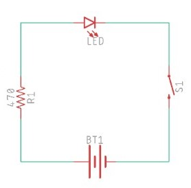
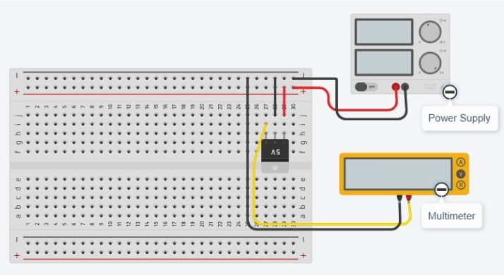
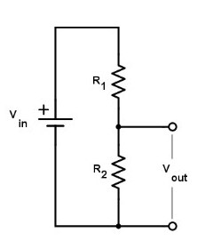
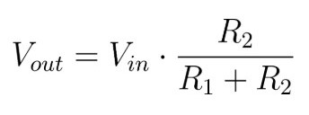
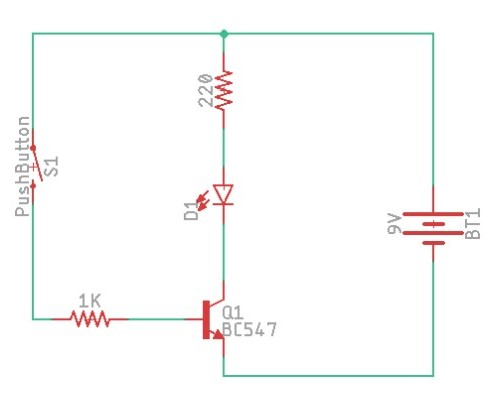
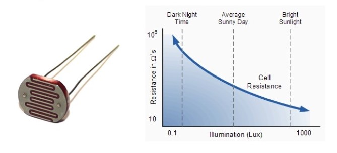
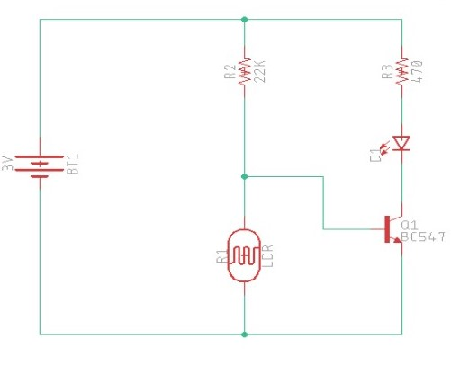
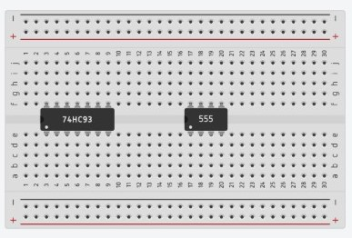
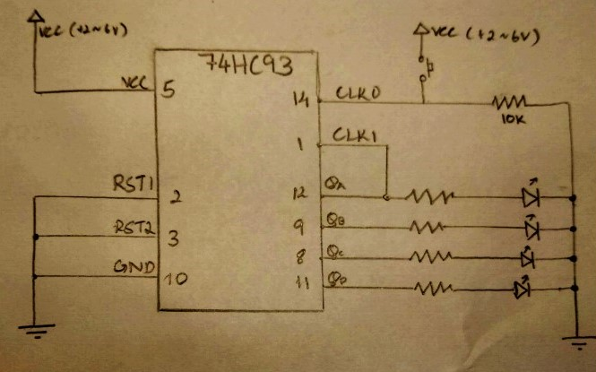

<!--Lesson 1 from qstp mechatronics-->

### L E S S O N  0 1          

# An Introduction To Electronics Prototyping

## Lesson Overview 

In this lesson, and throughout this module, we focus on the practical aspects of electronics prototyping that are immediately relevant to the design and construction of mechatronics devices. You will learn the following:

*   Using TinkerCAD as a circuit simulator.
*   Using breadboards.
*   Some fundamental electronic circuits, like logic gates, voltage divider, photoresistors  etc.

## Introduction to TinkerCAD

We shall be using a circuit simulator called [TinkerCAD](http://tinkercad.com), since prototyping this way can be done without any external hardware. Once you sign in with your Autodesk account, check out these 4 [interactive tutorials](https://www.tinkercad.com/learn/circuits) that will guide you through the basics of this simulator.

## Using a Breadboard

The breadboard is the most fundamental tool for electronics prototyping. They are great for creating temporary circuits and require absolutely no soldering. The following video explains how breadboard connections are made.

**Watch Video:**
[How to use a breadboard (for beginners)](http://www.youtube.com/watch?v=W6mixXsn-Vc)

### A Simple LED circuit

First, let us try recreating the LED circuit shown in the above video. The circuit schematic is shown below, try to implement yourself in TinkerCAD! You may use the _3V Coin Cell Battery_ as the power source.

 If all goes well, after commencing the simulation, clicking on the push button should light up the LED. [[Solution](https://drive.google.com/open?id=1htAHpEn9XENg5oG7oKpsmlNRWDZEhuP_)]

## Basic Electronics

### Voltage Regulator

Voltage regulators can supply steady and reliable voltage regardless of their input voltage. They are often used to power low voltage circuits from higher voltage DC sources like batteries and wall adaptors. For this reason, they are used to power microcontrollers and other sensitive components.

The following circuit uses the widely used 7805 voltage regulator IC to generate a stable 5V output that is measured by a multimeter. Recreate this and observe what happens as you change the input voltage from the power supply.

### Voltage Divider

A _voltage divider_ is a simple circuit that turns a larger voltage into a smaller one. It uses a series of resistors, as shown on the below, to create an output voltage that’s a fraction of the input one.

The equation for the output voltage is given by:

Using this concept, we can use potentiometers to create an adjustable voltage divider. To understand how a potentiometer works, see [this video](https://www.youtube.com/watch?v=Cor5ZfLcAHk). 

Try implementing a potentiometer as a voltage divider in TinkerCAD, and measure the output using a   multimeter. 

### RC Circuit

An _RC circuit_ simply consists of a resistor and capacitor in series. Try out the following circuit in TinkerCAD, and notice how the LED takes a few seconds to reach full brightness. Use the _slideswitch_ instead of a push button. 

__Note:__
    
* _Resistor value = 1kOhm, capacitor value = 10mF_
* _Polarised capacitors will get damaged if you connect them the wrong way, be careful!_

### Transistors

_Transistors_ can be used to make electrical switches, digital logic, and signal amplifiers. We shall be focusing on the most common type, bi-polar junction transistors (BJTs) in this lesson. For a guide to transistors, their operation and applications, check out the following tutorial.

**Tutorial**: [Transistors - Sparkfun.com](https://learn.sparkfun.com/tutorials/transistors/all)

#### As a switch

The following circuit uses the popular BC547 NPN transistor to act like a switch. Instead of requiring a physical press, the transistor switches on depending on the voltage at the base pin, which can be controlled by anything, for example, an arduino. Implement this in TinkerCAD!

#### As a logic gate

The [sparkfun tutorial](https://learn.sparkfun.com/tutorials/transistors/all#applications-i-switches) above shows the construction of 3 basic logic gates - NOT, AND, and OR. You’ll notice they only show a kind of shorthand, not the entire circuit. You have to complete the input and output circuit yourself, as well as figure out the values of the resistors. For example, [this](https://cdn.sparkfun.com/r/400-400/assets/learn_tutorials/1/9/3/logic-inverter-circuit.png) is the shorthand for a NOT gate, and [this](https://drive.google.com/open?id=1_hPvJVoyIZUgG_qGBL78q2I4gHHEkRGw) is the completed circuit. As a general rule, use 1K-10K at the transistor base, and 330-1000ohm for the resistor in series with LEDs.

Try out these logic gates in TinkerCAD. Also, try to implement a NAND gate.

#### Using a Photoresistor

_Photoresistors_ (aka _Light Dependent Resistor_ aka _LDR_) are a type of resistor whose resistivity depends on the intensity of light incident on it. The commonly used CdS photoresistors, shown below left, decrease their resistance in the presence of light, as shown in the graph below right.

The circuit given below turns on the LED only when the light falling on the LDR is below a particular value. Notice that the LDR and resistor form a simple voltage divider, whose output goes to the base of the NPN transistor.

When the intensity of light falls, the resistance of LDR increases. As this resistance increases in comparison to the other resistor, it causes the voltage dropped across the LDR to increase. When this voltage is large enough (0.7V for a typical NPN transistor), it causes the transistor to turn on the LED.

### Integrated Circuits

_Integrated Circuits_ (ICs) are the heart and brain of most electronic circuits. They pack thousands to millions, and sometimes billions of transistors onto a tiny package. Check out the following tutorial to learn about their structure, packaging, and usage.

**Tutorial**: [Integrated Circuits - Sparkfun.com](https://learn.sparkfun.com/tutorials/integrated-circuits/all)

We will mostly encounter ICs with the Dual In-line Package (DIP), as they are convenient to use with breadboards. As mentioned in the above tutorial, the area between each row of pins is perfectly spaced to allow DIP ICs to straddle the center area of a breadboard, as shown below.

Every IC has a very specific function and characteristic circuit. Some common examples are as follows:

*   **555:** A timer IC
*   **741:** An operational amplifier 
*   **L293D**: A motor controller
*   **ATmega328**: The microcontroller at the heart of Arduino

#### Example: The 74HC93

The 74HC93 IC, according to its datasheet, is described as a 4-bit binary ripple counter: this basically means it can count up in [binary](https://www.wikihow.com/Convert-from-Binary-to-Decimal) from 0000 to 1111. The following circuit represents its simplest implementation. The four LEDs represent each bit, and the button is used to increment the counter. Try out this circuit on TinkerCAD!

**Notes:**

*   Use a VCC (i.e. the +ve voltage) between 2-6V. You may use AA batteries or the power supply as a power source.
*   Observe that schematics often don’t have IC pins arranged in their actual order. This is meant for better readability. Check out [this](https://learn.sparkfun.com/tutorials/how-to-read-a-schematic/all#schematic-symbols-part-2) page if you need help reading schematics.