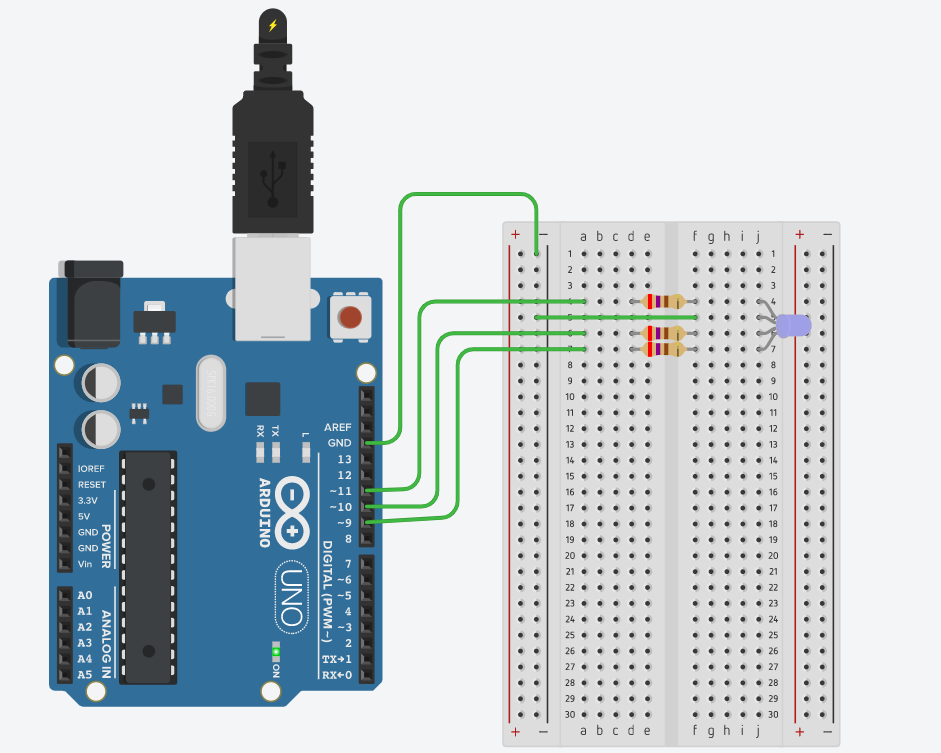
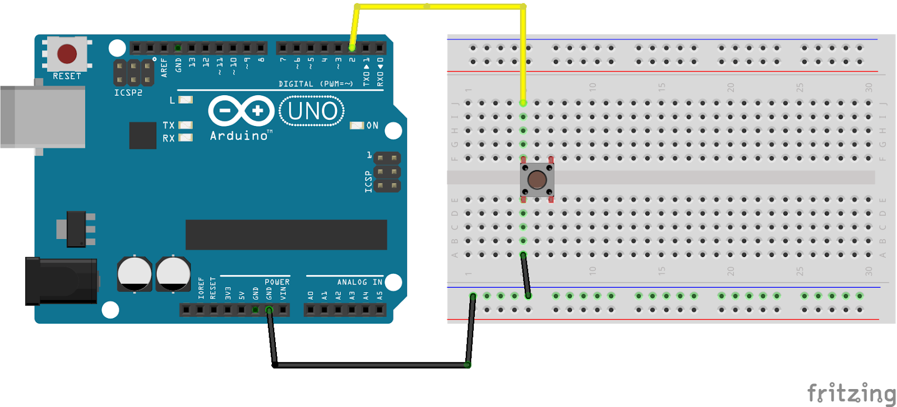
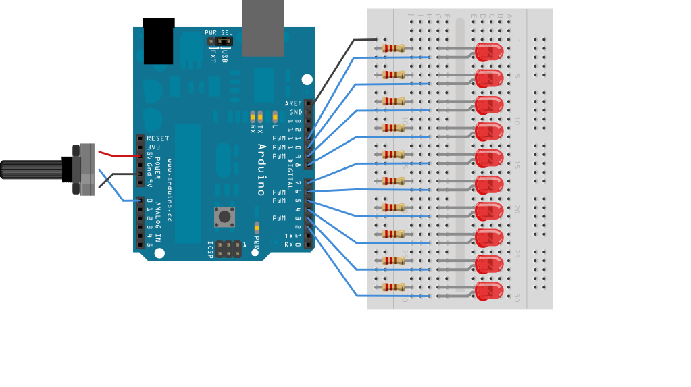

<!--Lesson 2 from qstp mechatronics-->

### L E S S O N  0 2

# Introduction To Arduino

## Lesson Overview 

This lesson aims to get you acquainted with the famous Arduino board. The examples not only introduce you to basic Arduino programming, but also give an idea of what the Arduino can be used for. Just like the last lesson, you are expected to try every example we show here, in Arduino IDE.


Topics covered are:

*   Arduino board layout
*   Intro to Arduino programming using Blink
*   Some basic examples using LEDs, buttons, sensors etc.

  

Note that it will help to have at least a very basic knowledge of C syntax, as Arduino programming is based on the C language. All the necessary C programming knowledge is included in [this](https://www.programiz.com/c-programming) tutorial (uptil the ‘arrays’ section).

  

## What is Arduino?
  

The Arduino is basically a very accessible and easy to program microcontroller. Unlike other microcontrollers, which need knowledge of registers and ports, the Arduino is programmed by a very basic C-derived language. [This](https://www.youtube.com/watch?v=CqrQmQqpHXc) [video](https://www.youtube.com/watch?v=CqrQmQqpHXc) explains what an Arduino is, what it is capable of, and the numerous projects one can use it for.

  

## Arduino Board Layout
  

The above diagram shows an Arduino UNO board with all the parts labelled and explained below.

  

1.  **USB Port:** Arduino can be powered by connecting it to your computer using a USB cable. It is also used for uploading code and communicating via the serial port.
2.  **Power Jack:** Used to power an arduino directly from a wall adaptor.
3.  **Voltage Regulator:** Controls and stabilises the voltage used by the Arduino and its components.
4.  **Crystal Oscillator:** A microcontroller is a clock based device. The crystal oscillator present on the arduino generates a clock of frequency 16MHz.
5.  **Reset controllers:** Resetting the arduino board starts the execution of a program from the beginning. Arduino can be reset in 2 ways : by pressing the reset button (17) and sending a 0V signal to the RESET pin (5).
6.  **3.3V power**
7.  **5V power**
8.  **GND (0V)**
9.  **VIN:** This pin can be used to power the arduino board from an external power source, from 7-20V.
10.  **Analog Pins:** These pins (labeled A0-A5) can be used to read continuous analog values (between 0 and 5V). They are often used to interface the Arduino with analog sensors.
11.  **Main Microcontroller:** This IC is the main microcontroller, that executes the code you program it with.
12.  **ICSP Pin:** Can be used to program the arduino board’s firmware. For advanced users only.
13.  **Power LED indicator:** Indicates whether the board is powered up correctly.
14.  **TX/RX LEDs:** The TX/RX pins flash to indicate transfer/receival of serial data between the computer and Arduino.
15.  **Digital I/O Pins:  **These pins can be programmed as input/output pins. When used as output, they can be set HIGH (+5V) or LOW (0V).
16.  **Analog Reference(AREF):** Can be used to set an external reference voltage(0-5V) as the upper limit for analog input pins.
17.  **Reset Button:** Pressing it causes the Arduino to restart its code.

  

## The Blink Sketch

  

The Blink sketch is like the “Hello World” program in the Arduino world. It simply consists of blinking the onboard LED (labeled ‘L’). No actual circuit connections are required! 

Follow the instructions on how to set up your code editor. Steps for using TinkerCAD and the Arduino IDE are given below.


### How to code an Arduino in TinkerCAD

Follow these steps if you are using TinkerCAD.
1. Open TinkerCAD and create a new circuit. Add an Arduino to the workspace.
2. Then click on Code and from the dropdown select “Text”. You can now type in your code.
3. To run your circuit click on Start Simulation.

### How to code an Arduino in Arduino IDE

If you are using an actual Arduino UNO board, follow these steps.

1.  Download and install Arduino Software (IDE) from [here](https://www.arduino.cc/en/main/software). The Integrated Development Environment (IDE) is a common coding environment for all arduino boards.
2.  Open the IDE and a new sketch will open up which would look like the image below. Sketch is just a name arduino uses for a program.
3.  Then just paste the entire code here.
4.  Now connect your Arduino UNO board to your PC using an A B USB cable and select the option "Arduino/Genuino Uno" under **Tools > Board** menu. Also make sure to select the correct port through which the PC is connected to the board under **Tools > Port** menu.
5.  Click on the "tick" button in upper left corner to compile the code and check for errors. After resolving any and all errors click on the "arrow" button next to it to upload the code to the board.
6.  After successful upload the Arduino Uno will start executing the code while drawing power from the PC through the USB cable.


### Code

You can copy the code from [here](https://github.com/schacon/blink/blob/master/blink.ino). 
  

### Explanation

Every Arduino sketch **must** have two particular functions:

  

1.  `void setup()`: The setup() function is called when a sketch starts and will only run once, after each powerup or reset of the Arduino board.
2.  `void loop()`: This function does precisely what its name suggests, that is loops consecutively, allowing your program to change and respond. Whatever code you write inside loop() will keep running as long as the Arduino is receiving power.

  

Let us examine the [Blink](https://github.com/schacon/blink/blob/master/blink.ino) sketch now, line by line.

  

```cpp
int led = 13;
```

  

This line assigns a name to the pin that the LED is attached to, i.e. pin 13.

  

Then we have the setup() function, which runs only once. It includes the following line.

```cpp
pinMode(led, OUTPUT);
```

This tells the Arduino to configure that pin as an output.


Then we have the following loop() function.

```cpp
void loop()
{
  digitalWrite(led, HIGH);  // turn the LED on (HIGH is the voltage level)
  delay(1000);               // wait for a second
  digitalWrite(led, LOW);    // turn the LED off by making the voltage LOW
  delay(1000);              // wait for a second
}
```

  

The `digitalWrite()` function tells a pin to either switch on (HIGH, or +5V) or off (LOW, or 0V).  The delay() function tells the Arduino to wait for a specified number of milliseconds.

  

## Reading Analog Values  

The following circuit reads the voltage from a potentiometer and sends it via USB to the serial port.

  

### Schematic


  

### Code

Copy the code from [here](https://create.arduino.cc/example/builtin/01.Basics%5CAnalogReadSerial/AnalogReadSerial/preview) and paste it into a new sketch in the Arduino IDE and upload the code to the board. After successful uploading open the serial monitor in the IDE by clicking on its button on top right corner. Trying varying the potentiometer’s knob - you should see the stream of values of the serial monitor change.


### Explanation

Whenever the serial port is to be used, it should be initialised with the following line _inside_ void setup(). The 9600 refers to the communication speed in bits-per-second.

```cpp
Serial.begin(9600);
```

  

The analogRead function reads the voltage at an analog pin and linearly converts it to a value between 0 and 1023. The Serial.println() function prints a variable to the serial monitor, followed by a newline (using Serial.print() to print data without the newline). The delay(1) is to limit the amount of data printed to the serial monitor.

  

**Exercise:** Convert the raw analog values to actual voltage and print that on the serial monitor.

  

## RGB LEDs
  

At first glance, RGB (Red, Green, Blue) LEDs look just like regular LEDs, however, inside the usual LED package, there are actually three LEDs, one red, one green and yes, one blue. By controlling the brightness of each of the individual LEDs you can mix pretty much any color you want. In the following circuit we shall use an Arduino to control the colour of an RGB LED.

  

## Schematic

1.  Use the Arduino pins 9, 10, and 11 for the green, blue and red terminals respectively.
2.  Each resistor value is 270 ohm, as is confirmed by checking its [colour code](https://www.electronics-tutorials.ws/resistor/res_2.html).

  


### Code


You can find the code [here](https://create.arduino.cc/editor/tannypb/e5278592-f6c8-4851-a69e-25d5785bb4e6/preview). The code comments do a good job of explaining each and every line.

  

#### About analogWrite()

As we saw in the **digitalWrite()** function, we specify two parameters, namely, the pin number and the state of the pin, HIGH or LOW. Similarly, in **analogWrite()** function, we specify two parameters - the pin number and the _analog value_ that we need to write to the pin. This analog value ranges from 0 to 255, 0 corresponding to ‘off’ and 255 corresponding to ‘on’.

How the Arduino does this is through a technique called Pulse-Width Modulation or PWM (learn more about that [here](https://learn.adafruit.com/adafruit-arduino-lesson-3-rgb-leds/theory-pwm)). But only a few pins on the Arduino UNO can support PWM: those that can have a tilde(~) sign beside them (i.e. pins 3, 5, 6, 8, 10, 11).

  

## Using Buttons

### Simple digitalRead()

The following circuit turns on the Arduino’s onboard LED when the push button is pressed.


The Arduino uses the digitalRead function to determine the state of the pin connected to the button. Find the code [here](https://create.arduino.cc/example/builtin/02.Digital%5CButton/Button/preview).


The resistor in this circuit is known as a pull-down resistor, and keeps the input pin at 0V when the button isn’t pressed. Without it, the pin would be ‘floating’ between 0 and 5V, erroneously triggering the digitalWrite() function.
  

### Internal Pullup

A pullup resistor is similar to a pulldown one, except it keeps the pin at 5V when the button isn’t pressed. The Arduino has an inbuilt pullup resistor (not a pulldown sadly), which can be activated using pinMode(). The following circuit does the same thing as the previous one, but without the external resistor. Note the changes.




Find the code [here](https://create.arduino.cc/editor/tannypb/23406794-092a-4a4d-afeb-eb515af0410e/preview).

  

### Toggling an LED and Debouncing

Now we shall try to toggle (i.e. switch the state) an LED using a button. However, we might run into the problem known as **contact bouncing**. Push buttons have a springy nature due to which the Arduino might interpret a single press as multiple presses and this may fool the program. We deal with this mechanical problem elegantly in the code itself.

  

### Schematic


  

### Code


You may refer to the code from [here](https://www.arduino.cc/en/tutorial/debounce). For a line by line explanation of the code, check out the appendix at the end of this lesson.

  

## LED Bargraph
  

[This](https://www.arduino.cc/en/Tutorial/barGraph) tutorial shows you how to wire and code an LED bar graph that responds to the output from a potentiometer. Try it out yourself with an Arduino and the IDE!

  




  

**Exercise:** Instead of a potentiometer, connect an LDR to the analog pin illuminate the bar graph according to the light levels. Note you will have to make a voltage divider with the LDR (like in this [tutorial](https://learn.sparkfun.com/tutorials/photocell-hookup-guide/all#example-circuit)). Also, make it so that when it is completely dark, only one LED should light up, and at full brightness, all LEDs should. This can be done by tweaking the [map()](https://www.arduino.cc/en/Reference/Map) function.

  

## Practice Problems

  

1.  Make an LED flash without using the delay() function. Take help from this tutorial.
2.  Measure temperature using the TMP36 sensor,  and send the temperature in Celsius and Fahrenheit over to the serial monitor.

  

## Appendix
  

### Explanation for Debounce Code

```cpp
const int buttonPin = 2;    
const int ledPin = 13;
```

  

13 and 12 are the pins to which the LED’s  anode and Button pin is connected. (Note that we have defined these variables as constant integers as these won't be changed throughout the code)

  

```cpp
int ledState = HIGH;     
int buttonState; 		  
int lastButtonState = LOW;
```

  

Here we have defined the variables that will be changed throughout the code. ledState is the current state of the output pin. buttonState is the current reading of the button (HIGH if pressed, LOW if not pressed). lastButtonState is the previous state of the button.

  

```cpp
unsigned long lastDebounceTime = 0;  
unsigned long debounceDelay = 50;
```

  

lastDebounceTime states the last time the output was toggled. debounceDelay is the debounce time i.e.

  

```cpp
void setup() 
{
  pinMode(buttonPin, INPUT);
  pinMode(ledPin, OUTPUT);

  // set initial LED state
  digitalWrite(ledPin, ledState);
}
```

  

All the pin modes and the initial variables are generally defined in the void setup() function.

  

```
void loop() {
  // read the state of the switch into a local variable:
  int reading = digitalRead(buttonPin);

  // check to see if you just pressed the button
  // (i.e. the input went from LOW to HIGH), and you've waited long enough
  // since the last press to ignore any noise:

  // If the switch changed, due to noise or pressing:
  if (reading != lastButtonState) {
    // reset the debouncing timer
    lastDebounceTime = millis();
  }

  if ((millis() - lastDebounceTime) > debounceDelay) {
    // whatever the reading is at, it's been there for longer than the debounce
    // delay, so take it as the actual current state:

    // if the button state has changed:
    if (reading != buttonState) {
      buttonState = reading;

      // only toggle the LED if the new button state is HIGH
      if (buttonState == HIGH) {
        ledState = !ledState;
      }
    }
  }

  // set the LED:
  digitalWrite(ledPin, ledState);

  // save the reading. Next time through the loop, it'll be the lastButtonState:
  lastButtonState = reading;
}
```

The `millis()` function returns the number milliseconds elapsed till it is called after arduino begins to run the program. It is generally used to find the time interval between two instances in a program. (This number overflows and resets to zero after a huge period of 50 days)