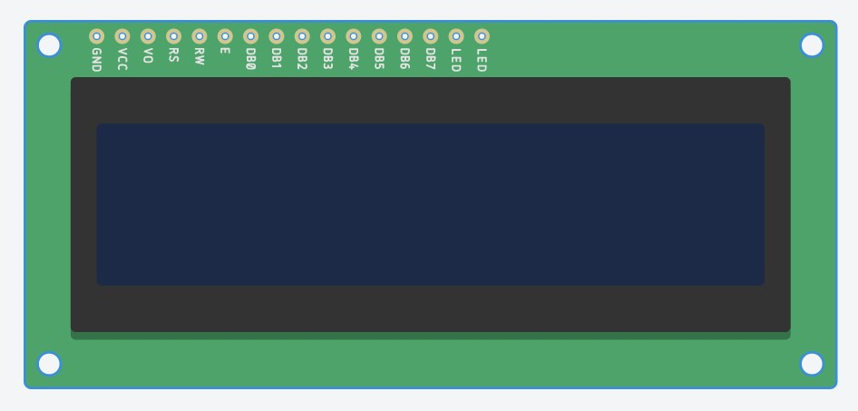
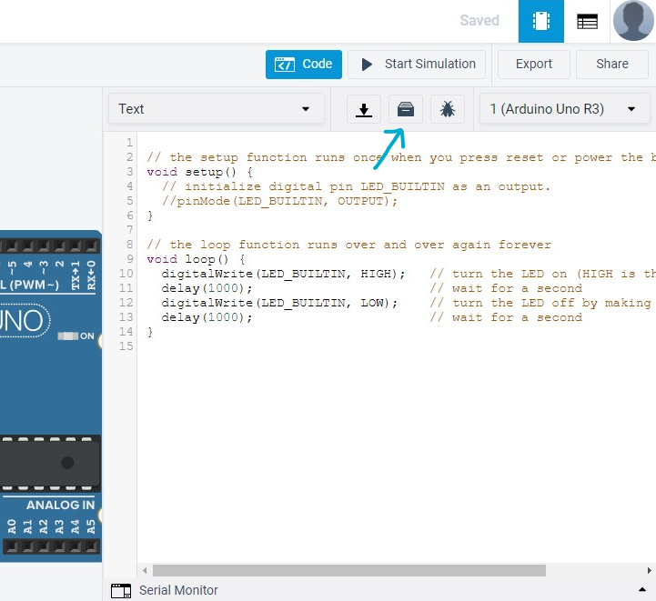
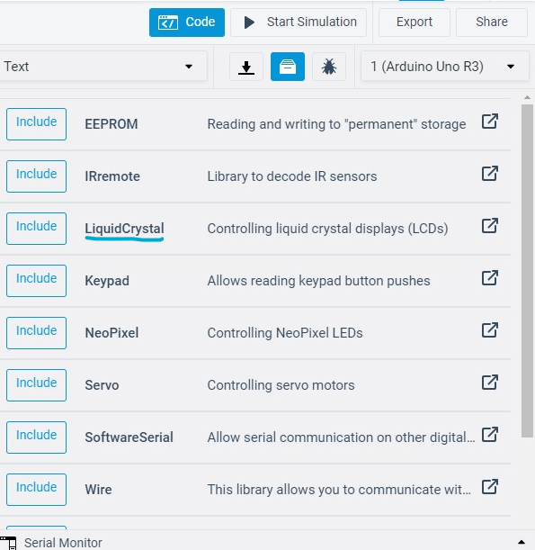
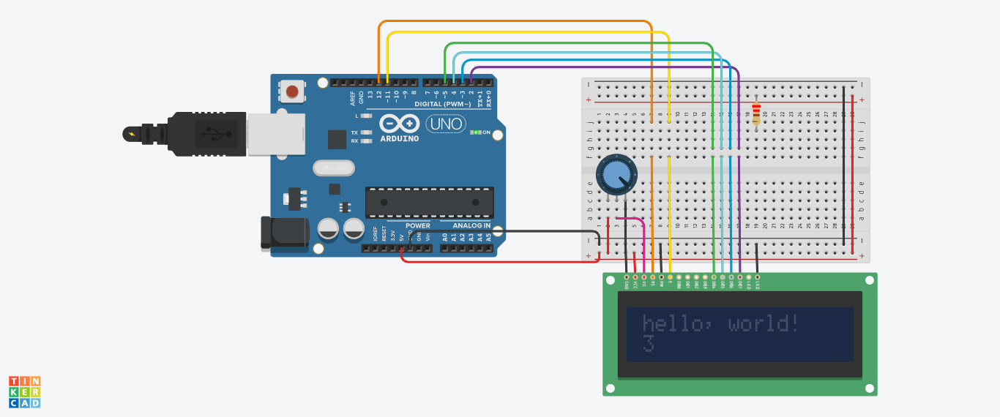

<!--Lesson 3 from qstp mechatronics-->

### L E S S O N  0 3

# Arduino: Peripherals and Communication

## Lesson overview

We continue to tread into the world of Arduino. This lesson, we shall introduce the most fundamental and commonly used mediums for inputting and outputting data: the serial monitor and LCD screens respectively. You may attempt the optional section if you find these topics easy and have time.

Topics covered are:

- What Arduino libraries are, and how to use them.
- Using a 16x2 alphanumeric LCD displays.
- Sending and reading data on the serial port.
- Arduino String class.
- Distance Sensors (optional)

## LCD displays

These are one of the most widely used LCD displays for Arduino projects. They can display alphanumeric characters and contain 2 rows of 16 characters each.

The actual method of sending data to this LCD to display is detailed and cumbersome, mostly in the realm of advanced microcontroller programming. However, the LiquidCrystal library lets you display messages in only a couple of lines.

**What is a library?**

Libraries in general (technical sense) are a collection of objects that can be incorporated into your framework whenever required. The Arduino has various libraries built for different components that you might need while designing a circuit. Whenever you need to use a component or a function related to that, you need to use the parent library. The TinkerCAD circuit simulator has a limited list of libraries for components like the LCD, IR remote, Servo motor etc.

**How to include library in tinkercad :**

Luckily, tinkercad has a very simple user interface and you don’t need to go through much hassle to use a library. To import a library:

1. Click on the libraries button on the upper right corner of your code editor:

2. Browse list of available libraries, click on LiquidCrystal. This is the name of the library meant for our LCD display.

3.Click on the include button to the left of the library's name in the search menu to import the library into your code.

4.You may also import a library by adding a #include <libraryname.h> to the top of your code.

### **Hello World, on an LCD**

Let’s start with the simplest possible program, that displays the cliche “Hello, world!” message, along with the time elapsed since booting. Check out the tutorial below.

**Tutorial:** [Arduino - HelloWorld](https://www.arduino.cc/en/Tutorial/HelloWorld)

Here’s what the circuit looks like in TinkerCAD.

### **Sensor Data**

In this circuit, we shall implement a common application of the LCD; to display sensor data. Follow the tutorial below, which displays light levels and temperature on the LCD.

**Tutorial:** [LCD Displays and Sensors](https://learn.adafruit.com/adafruit-arduino-lesson-12-lcd-displays-part-2?view=all)

_Note:_ The above tutorial uses code which expects different LCD wiring. Either change the pin numbers in the code, or rewire the circuit.

## Serial Communication

### **Printing data**

You have already been acquainted with basic Serial port functions in Lesson 2. Let us review them:

1. `Serial.begin(speed)`: Initialises the serial port for communication at set speed.
2. `Serial.print(data)`: Prints data into the serial monitor. Data can be any simple variable, like int, float, char etc.
3. `Serial.println(data)`: Just like Serial.print(), but adds a newline character (‘\n’) at the end of the data.

### **Reading Data**

Apart from printing data, the serial monitor can also be to send data to the Arduino. You can do this by typing the message in the textbox within the serial monitor and pressing enter. The Arduino then receives this data, and we can use some Serial related functions to make sense of it.

Reading serial data is especially useful if you want to control the Arduino without physical buttons or sensors, or if you want to debug your program. In advanced projects you may use computer programs like Processing to communicate with the Arduino this way.

Check out [this tutorial](https://www.norwegiancreations.com/2017/12/arduino-tutorial-serial-inputs/) for basic usage of the Serial.read() and Serial.available() functions. They also show how the Arduino can parse commands from serial data using Serial.readStringUntil(). This tutorial also introduces the String class; learn about it [here](https://www.tutorialspoint.com/arduino/arduino_strings.htm) (you may need it for the practice problems).

After having tried this, try the following circuit in TinkerCAD: It accepts the brightness values for red, green and blue and accordingly glows an RGB LED. [This tutorial](https://www.arduino.cc/en/Tutorial/ReadASCIIString) even explains the code line-by-line.

## Distance Sensors

Distance sensors, calculate the distance between the sensor and an object. They do so by emitting some kind of signal (like sound or electromagnetic waves) and then analysing the change in the signal upon its return after getting reflected from the object.

Some common types of distance sensors are:

- Ultrasonic Sensors
- Infrared(IR) Sensors
- LiDAR

We shall be using ultrasonic sensors, as they are the easiest to use, and we can simulate them on TinkerCAD. Refer to the following tutorial on how to use an ultrasonic sensor with an arduino.

**Tutorial:** [Arduino - Ultrasonic Sensor](https://www.tutorialspoint.com/arduino/arduino_ultrasonic_sensor.htm)

### Practice Problem

Read strings from the serial port, and display them on an LCD. If the string is more than 32 characters long, print an error message instead.