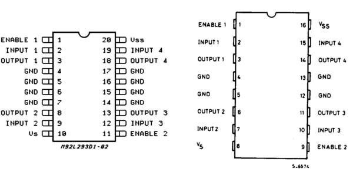

<!--Lesson 4 Part 2 from qstp mechatronics-->

### L E S S O N  0 4

# Motor Control Part II

## Lesson Overview

In Part II of Motor Control, we shall be learning about the L293D motor driver IC, which has many advantages over using a transistor. We shall also study about stepper motors. Since Tinker CAD cannot simulate stepper motors, this topic is limited to theory, although we shall be acquainted with Stepper.h which is the go-to library for running stepper motors using Arduino.

## The L293D Motor Driver

The L293D is a motor driver IC which is capable of driving two motors independently. The most commonly used IC, it is based on the H-bridge circuit, which not only helps control speed, but also the direction of the motor’s rotation. Follow [this](https://www.modularcircuits.com/blog/articles/h-bridge-secrets/h-bridges-the-basics/) link to know more about the H-bridge principle.

The diagram below shows the pin out of an L293D IC. Notice it has two power pins: VCC1 is connected to the Arduino’s power supply, i.e. 5V, and VCC2 is connected to the external voltage for the motor (usually 6-12V).

The Enable pins will be connected to VSS (5V). Check out the following Tinker CAD circuit.

You can find the circuit below.

**Tinker CAD circuit**: [Arduino and L293D](https://www.tinkercad.com/things/6UcR3XqcDRT-l293-motor-driver-ic-with-2-motors)

The code and the circuit in the circuit above rotates both the motors clockwise for 5 seconds and anticlockwise for the next 5 seconds and so on.

You can also change the speed of rotation by passing PWM signals to the Enable pins (everything has been properly described in the code).

# Stepper motor

Stepper motors bridge the gap between regular DC motors and servo motors. They can be made to rotate a specific angle very precisely, and aren’t limited to 180 degrees like regular servos. Even cheap stepper motors offer at least a 1.8° resolution. How does a stepper motor achieve this? Watch the following video to find out.

**Video**: [Stepper Motor - How It Works](https://www.youtube.com/watch?v=TWMai3oirnM)

The most commonly used stepper motors, NEMA17, are hybrid synchronous, bipolar brushless motors. These have 1.8° resolution and are used in 3D printers, CNC machines, advanced robotic devices etc.

Stepper motors have 4, 5 or 6 wires, although we usually only use the 4, which are connected across the coils, in the above manner (the center tap wires are usually unconnected. To understand how this pin out can be used to rotate a stepper motor, step by step, watch the following video by Great Scott.

**Video**: [How to use Stepper Motors](https://www.youtube.com/watch?v=bkqoKWP4Oy4)

An L293D can be used to run this motor. In the following circuit, each channel of the driver IC is connected to one of the motor’s ‘coils’.

One can use the Stepper.h library to easily control these motors. Refer to [this tutorial](https://core-electronics.com.au/tutorials/controlling-steppers-with-arduino.html) to learn about the 2-3 functions this library offers. Unfortunately, though you can use this library on Tinker CAD, there are no stepper motor objects. Instead, try attaching LEDs to the Arduino pins to observe the flow of current. Does the library use wave step, full step, or half step drive?

# Practice Problem

Create a circuit with an L293D, DC motor, Arduino, potentiometer, and distance sensor. If the sensor sees objects within 20cm, the motor should stop. Otherwise the motor should run, at a speed determined by the potentiometer.