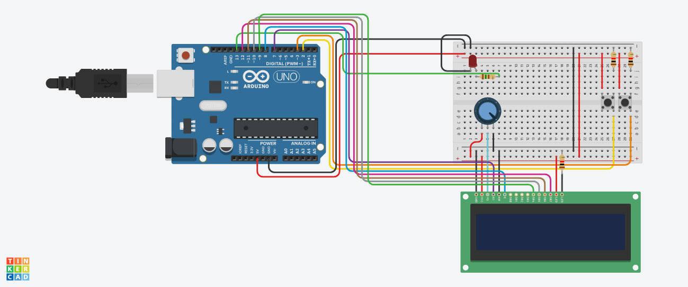
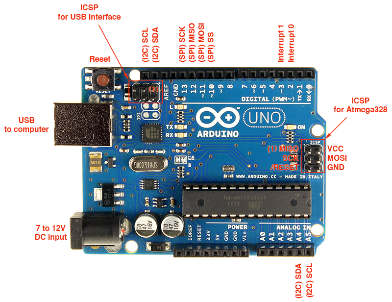
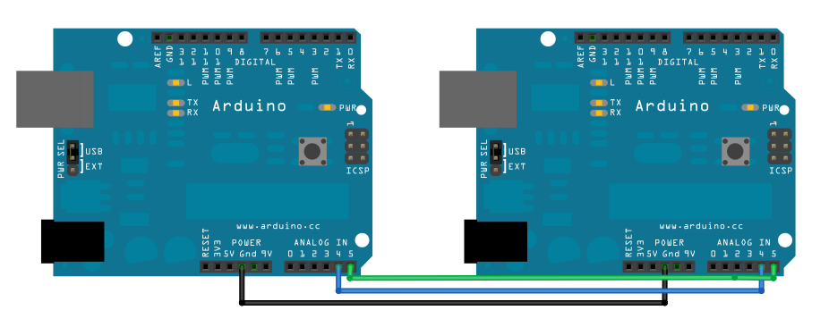
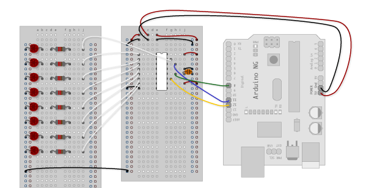

# LESSON 05

# Advanced Arduino: **Interrupts and I2C**

# **Lesson Overview**

In this lesson, we shall deal with advanced concepts fundamental to not just Arduino, but microcontrollers in general. The previous lessons dealt with the very basics, that were enough for the simplest of circuits. However, you shall need to familiarise yourself with the concepts introduced in this lesson if you want to program microcontrollers for robots.

Topics covered are

- Introduction to interrupts.
- Using external interrupts with Arduino.
- I2C communication and Wire.h.
- Shift registers (optional).

# Interrupts

Consider a fast moving car. If it suddenly gets hit by another car in the opposite direction, the first thing that happens is the accelerometer sensor present in the car senses a sudden deceleration and triggers an external interrupt to the microcontroller present in the car. Then MCU produces an electric signal to deploy the airbags immediately. Microcontrollers present in the car monitor many things simultaneously like sensing speed of the car, checking other sensors, controlling air conditioner temperature etc. So what makes a sudden opening of an airbag in seconds? An interrupt signal is used here which has the highest priority of all.

So now, what are interrupts? Interrupts are a mechanism by which an I/O or an instruction can suspend the normal execution of the processor and gets itself serviced like it has higher priority.

In general, there are hardware and software interrupts. Hardware interrupts can be further classified into external and pin change interrupts. The Arduino can deal with both, although we shall be only looking at external interrupts as they are the simplest.

## External Interrupts on Arduino

Any kind of interrupt is attached to a relevant interrupt service routine (ISR). So when an external interrupt occurs, the processor immediately executes the code present in ISR and returns back to state where it left the normal execution.

We initialise an external interrupt with the following line in void setup():

```arduino
attachInterrupt(digitalPinToInterrupt(pin), ISR, mode);
```

**Mode:** This tells the Arduino what kind of scenario the interrupt should be triggered, and can be among the following keywords. 

- *RISING*: To trigger an interrupt when the pin transits from LOW to HIGH.
- *FALLING*: To trigger an interrupt when the pin transits from HIGH to LOW.
- *CHANGE*: To trigger an interrupt when the pin transits from LOW to HIGH or HIGH to LOW (i.e., when the pin state changes ).

**ISR**: The name of the ISR, i.e. the function to be executed when the interrupt is triggered.

**digitalPinToInterrupt(pin)**: Here, pin represents the pin number which will be monitored for interrupts. The Arduino UNO only supports pins 2 and 3 for this purpose. 

### Example Circuit

The following circuit demonstrates the use of external interrupts. The LCD counts up once a second, while 2 buttons can be used to switch on and off an LED, respectively. Try to implement this on TinkerCAD (the connections for the LCD, buttons and LED are the usual circuits covered in previous lessons).



The code can be found [here](https://create.arduino.cc/editor/tannypb/9b1b963e-8b54-47f4-9c54-ca498c301c1b/preview).Notice that because of the delay(1000), the loop function won’t execute anything else for an entire second. This problem is circumvented using the ISR, which can be triggered during the 1 second pause.

Some conditions are to be kept in mind while using Interrupt.

- Interrupt Service Routine function (ISR) must be as short as possible.
- **delay()** function doesn’t work inside ISR and should be avoided.
- Variables manipulated inside ISRs should be declared as volatile. We have done so with the variable named output in our code. See why [here](https://arduino.stackexchange.com/a/20998).

# I2C Communication

I²C (Inter-Integrated Circuit), pronounced I-squared-C, is a kind of communication used between microcontrollers and other components. The Arduino can communicate with a wide range of devices using I²C, including accelerometer ICs, OLED screens, storage chips etc. Your project might find the need to have multiple microcontrollers; in that case, I²C is an effective way to keep them coordinated. Another big advantage over other protocols like SPI, is that I²C only required two wires: SDA and SCL.

For Arduinos, the Wire.h library allows you to communicate with I²C devices. On the Arduino, the SCL and SDA pins can be found in two places; the first being next to the AREF pin, and the second being analog pins A4 and A5.



### Example Circuit

The following tutorial explains Wire.h and how to use it to make a simple circuit consisting of two Arduinos that communicate using I²C.



**Tutorial**

Arduino - MasterWriter

[https://www.arduino.cc/en/Tutorial/MasterWriter](https://www.arduino.cc/en/Tutorial/MasterWriter)

In the circuit above, one Arduino (the master) sends data (which is a continuously increasing integer) to another Arduino (the slave). Once the slave receives a transmission, the function **receiveEvent()** is called. It is similar to an ISR, in that it is immediately executed regardless of what was going on in void loop(). The conditions for ISRs discussed above apply to **receiveEvent()** too.

Learn more about Wire.h functions from the [documentation](https://www.arduino.cc/en/reference/wire). 

## Practice Problems

1. There is a function generator on TinkerCAD. Configure it to output a low frequency square wave, around 1-20Hz, and not exceeding 5V in voltage. Using external interrupts, code an Arduino to measure the frequency of the function generator.
2. Create a circuit with two Arduinos, one master and one slave. The master reads the serial port for strings. Once the user enters a string, it checks if it is 32 characters or less. If no, it prints an error message. If yes, it sends this string to the slave via I2C. The slave then displays this message on an LCD screen.

## Shift registers (Optional)

Sometimes you may run out of digital pins on your Arduino. You may instead use an Arduino Mega, but a cheaper option for most cases is to use the 74HC595 shift register IC. It uses just 3 Arduino pins to control 8 outputs. You can even ‘daisy chain’ 2 or more shift register ICs to control 16 or more outputs! Follow this tutorial and try to implement these circuits on TinkerCAD.



**Tutorial**

Arduino - ShiftOut

[https://www.arduino.cc/en/tutorial/ShiftOut](https://www.arduino.cc/en/tutorial/ShiftOut)